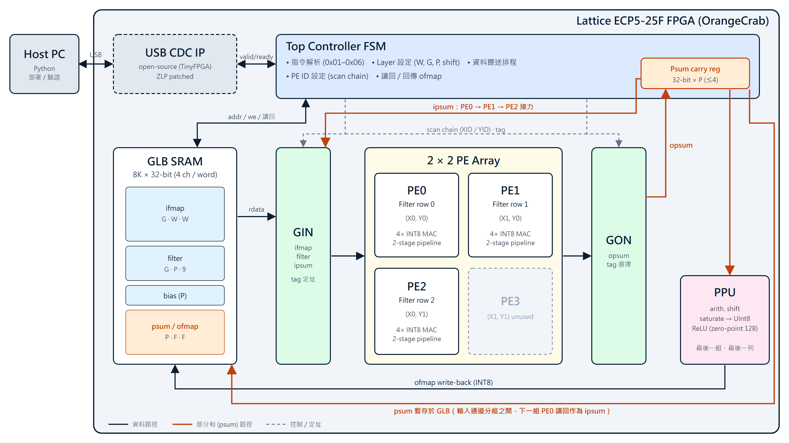

# Eyeriss on ECP5

An Eyeriss-style CNN accelerator written in SystemVerilog and running on a
Lattice ECP5-25F FPGA (OrangeCrab). It computes multi-channel 3×3 convolution
layers in INT8 and is driven from Python over USB. As an end-to-end test, the
first 3×3 convolution layer of a ResNet18 skin-lesion classifier is offloaded
to the FPGA, and its output matches the software golden model bit for bit.

以 SystemVerilog 在 Lattice ECP5-25F FPGA（OrangeCrab）上實作 Eyeriss 架構之 CNN 加速器，
支援多通道 INT8 3×3 卷積，透過 USB 由 Python 控制。並將自行訓練之皮膚病灶分類 ResNet18
中 `layer1[0].conv1` 卸載至 FPGA，輸出與軟體參考模型逐位元一致。



## Dataflow (Row Stationary)

- **Weight stationary per row**: PE0–PE2 each hold one row of the 3×3 filter
  (up to 4 filters × 4 channels) and keep it for the whole channel group.
- **Input reuse**: the ifmap slides through a 3-entry shift register inside the PE.
  The first pixel of a row loads 3 values; every following pixel loads only 1.
- **Partial-sum relay**: the psum of one output pixel goes PE0 → PE1 → PE2 through a
  carry register in the controller, then through the PPU (shift, saturate, ReLU) into the GLB.
  With more than 4 input channels, channel groups are processed in turn and the
  32-bit psum between groups is kept in the GLB.
- **Addressing**: each PE gets an (X, Y) ID through a scan chain; GIN/GON use tags to
  send data to, or collect results from, a single PE, a row, or all PEs.

## Results

| Item | Result |
|---|---|
| Target | Lattice ECP5-25F (LFE5U-25F), OrangeCrab r0.2 |
| Resources | DSP 20 / 28, EBR 16 / 56, LUT 30 %, FF 19 % |
| Clock | 48 MHz (Fmax ≈ 55 MHz, nextpnr, default speed grade) |
| Data format | INT8 activations and weights, 32-bit partial sums |
| Supported layer | 3×3 conv, stride 1, bias + ReLU, ≤ 64 input channels, ≤ 4 filters per run, tiles ≤ 32×32 |
| RTL simulation | `tb_top` 15/15, `tb_layer` 543 reply bytes / 0 errors, `tb_zlp` pass |
| Hardware regression | `test_eyeriss.py` 13/13 on the board |
| ResNet18 `layer1[0].conv1` (64→64, 56×56) | 200,704 / 200,704 outputs bit-exact, SQNR 28.2 dB vs float, prediction unchanged |

Why a 2×2 array: every PE uses four 18×18 multipliers, and a 3×3 array would need
36 of the 28 available. Packing four INT8 channels into one 32-bit word
lets each PE do four MACs per cycle to make up for it.

## Repository layout

| Path | Contents |
|---|---|
| `Eyeriss_SoC_Top.sv` | Top level: USB command decoder, layer sequencer, psum carry registers |
| `GLB_SRAM.sv` | Global buffer, 8K × 32-bit |
| `PE_array/` | PE (4× INT8 MAC, 2-stage pipeline), PE array, GIN / GON multicast networks |
| `PPU/` | Post-quantization, ReLU, max-pool (max-pool implemented but not enabled) |
| `usb/` | Third-party USB CDC IP (Apache-2.0), see [usb/README.md](usb/README.md) |
| `eyeriss_host.py` | Host library: protocol, packing, tiling, bit-accurate emulator, golden model |
| `test_eyeriss.py` | Hardware regression (`--emulate` runs without a board) |
| `examples/deploy_resnet_eyeriss.py` | ResNet18 layer offload with bit-exact, SQNR and classification checks |
| `sim/` | Testbenches, USB behavioural stub, test-vector generator |
| `docs/` | Architecture diagram |

## Host protocol

| Command | Meaning |
|---|---|
| `01 LEN_L LEN_H bytes` | Legacy: write bytes (one per word) from address 0 |
| `02` | Run, reply P·F·F bytes |
| `03 W SHIFT` | Legacy config (1 channel group, 1 filter, ReLU, no bias) |
| `04 ADR(2) N(2) words` | Write N little-endian 32-bit words |
| `05 ADR(2) N(2)` | Read N words |
| `06 W G P SHIFT FLAGS` | Layer config; replies `06` (ok) or `EE` (does not fit). FLAGS: bit0 ReLU, bit1 bias |
| `FF` | Ping (echo) |

Output = `max(128, clamp((Σ(x−128)·w + bias) >>> SHIFT, −128, 127) + 128)` (zero point 128).

## Build and run

Requires [OSS CAD Suite](https://github.com/YosysHQ/oss-cad-suite-build)
(yosys, nextpnr-ecp5, ecppack, iverilog, dfu-util). Set `OSS_CAD_SUITE` if it is not
at the default location used by the scripts.

```sh
sh sim/run_sim.sh          # all testbenches
sh build.sh                # synthesis + place & route -> build/eyeriss.dfu
sh build.sh flash          # program via DFU (hold the button while plugging in)
python test_eyeriss.py COM3
python test_eyeriss.py --emulate
```

The OrangeCrab DFU bootloader only accepts uncompressed bitstreams.

## References

- Y.-H. Chen, T. Krishna, J. S. Emer, V. Sze, "Eyeriss: An Energy-Efficient Reconfigurable
  Accelerator for Deep Convolutional Neural Networks," *IEEE JSSC*, vol. 52, no. 1, 2017.
- USB CDC IP: [tinyfpga_bx_usbserial](https://github.com/davidthings/tinyfpga_bx_usbserial),
  based on [TinyFPGA-Bootloader](https://github.com/tinyfpga/TinyFPGA-Bootloader).
- Board: [OrangeCrab](https://github.com/orangecrab-fpga/orangecrab-hardware).

## License

MIT for the code in this repository, except `usb/`, which is Apache-2.0 (see `usb/LICENSE`).
